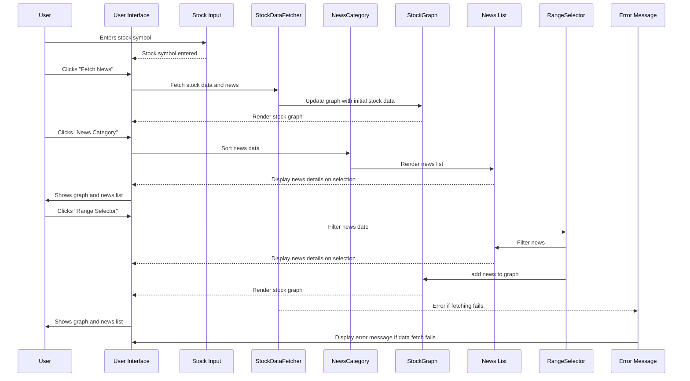

# StoxNews(front-end part)
## Project Overview
### Objective:
The goal of this project is to create a comprehensive company analysis platform that provides multi-faceted insights into a given company's performance, competitive positioning, industry trends, and relevant government policies. By inputting a company's name, users can access a holistic view of the company's current status and its business environment.

### Target Audience:

- Investors and financial analysts
- Business strategists and consultants
- Corporate executives and decision-makers
- Market researchers and industry analysts

### Key Features:

1. Company Status Analysis:
    - Recent financial reports and key performance indicators
    - Current business model overview
    - Notable recent developments or announcements
2. Competitive Positioning:
    - Comparison with key competitors in various aspects (e.g., market share, financial performance, product offerings)
    - Strengths and weaknesses relative to competitors
    - Unique selling propositions and competitive advantages
3. Industry Updates:
    - Recent trends and developments in the company's industry
    - Market size and growth projections
    - Emerging technologies or disruptive forces affecting the industry
4. Regulatory and Government Impact:
    - Recent or upcoming government policies affecting the company or industry
    - Regulatory changes and their potential impact
    - Government incentives or restrictions relevant to the company's operations

This platform aims to provide a comprehensive, data-driven snapshot of a company's current position within its business ecosystem, enabling users to make informed decisions and gain valuable insights into the company's potential future performance.

## Docker
How to run frontend
```
sudo docker image build -t stock-frontend .
sudo docker run -p 3000:3000 stock-frontend
```

## StoxNews Frontend
The following demonstrates the sequence diagram for the frontend


## Project Structure
```markdown
.
├── Dockerfile
├── index.html
├── LICENSE
├── mockApi.js
├── nginx.conf
├── README.md
└── src
    ├── assets
    │   ├── GOOG.png
    │   ├── INTC.png
    │   ├── META.png
    │   ├── NVDA.png
    │   ├── PACCAR.png
    │   └── TSLA.png
    ├── components
    │   ├── animation.js
    │   ├── breakingNews.js
    │   ├── dashboard.js
    │   ├── homepage.js
    │   ├── navigation.js
    │   ├── news.js
    │   ├── stockDataFetcher.js
    │   ├── stockGraph.js
    │   └── utils.js
    ├── css
    │   ├── animations.css
    │   ├── dashboard-section.css
    │   ├── homepage.css
    │   ├── navbar.css
    │   ├── news.css
    │   ├── responsive.css
    │   └── visibility.css
    ├── index.js
    └── styles.css
```
## Tasks done
2024/11/30 fixed incorrect display issue
2024/11/29 responsive design and finalize UI
2024/11/28 applied top news analysis api
2024/11/28 wordcloud added on homepage
2024/11/15 dashboard section added
2024/10/25 improved GUI
2024/10/25 News Integrated
2024/10/20 improved GUI
2024/10/18 graph added, files modularized 
2024/10/14 Backend data integration
2024/10/05 Docker image built
2024/10/04 Nginx set up
2024/09/27 draft web UI(html/js/css) with mockdata
2024/09/20 UI figma design
2024/09/14 Information research
